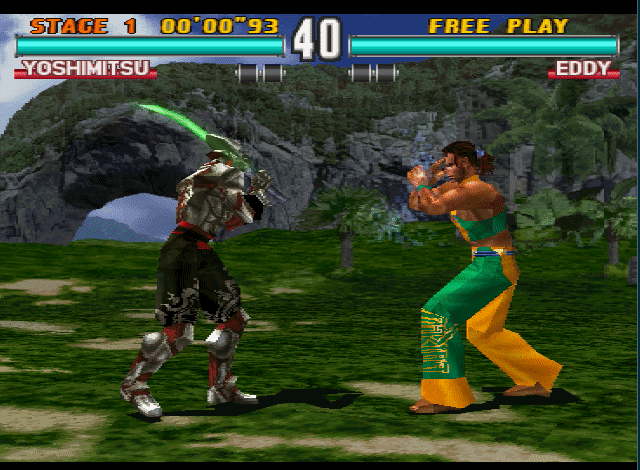

# The PlayStation X Learning Environment
_Project under construction_

The PSX Learning Environment (PSXLE) is a project under construction in a very early stage.
It was inspired by [The Arcade Learning Environment (ALE)](https://github.com/mgbellemare/Arcade-Learning-Environment)
and is built on top of the PlayStation emulator [pcsxr](https://archive.codeplex.com/?p=pcsxr).

The development of this project is temporarily paused, so the author left it in a provisional state hoping to continue
the work at some point. Currently, a toy executable can be built that sends random input actions to the emulator.

## Quick start ##
_You will need to download the iso files for the corresponding games_

```
$ git clone git@github.com:carlospzlz/psxle.git
$ cd psxle
$ mkdir build
$ cd build
$ cmake ..
$ make -j2
$ ./psxle <iso_file> <game_state>
```
---
**NOTE**

**iso_file:** A PlayStation iso file that _pcsxr_ can read.<br/>
**game_state:** A game state saved in _pcsxr_ (some states are provided in `resources/game_states`)

---

## Example
```
$ ./psxle tekken3.iso ../resources/game_states/yoshimitsu_eddy_medium.gz
```

